# G0

AI assistant for Godot.

## Architecture

The G0 agent is built with a modular, layered architecture that integrates multiple AI providers, tools, and the Godot documentation system.

```mermaid
graph TB
    subgraph "Agent Core"
        AgentClient[AgentClient<br/>Agentic Loop Controller]
        ChatHistory[Chat History<br/>Conversation Context]
        AgentStep[Agent Steps<br/>Reasoning Tracker]
    end
    
    subgraph "AI Provider Layer"
        IChatClient[IChatClient Interface<br/>Microsoft.Extensions.AI]
        GeminiAdapter[GeminiChatClientAdapter]
        OpenAIClient[OpenAI Client]
        AzureClient[Azure OpenAI Client]
    end
    
    subgraph "Tools & Functions"
        ToolRegistry[AI Function Registry]
        GodotDocsTool[search_godot_docs<br/>get_godot_class_info<br/>list_godot_doc_topics]
        SerperTool[search_web]
        DocsIndex[(Documentation Index<br/>Searchable Knowledge Base)]
    end
    
    subgraph "External APIs"
        Gemini[Google Gemini API<br/>gemini-2.5-flash]
        OpenAI[OpenAI API<br/>gpt-4o]
        Serper[Serper API<br/>Web Search]
    end
    
    %% User Input Flow
    User([User Query]) -->|Message| AgentClient
    
    %% Agent Loop
    AgentClient -->|1. Build Context| ChatHistory
    AgentClient -->|2. Send with Tools| IChatClient
    IChatClient -->|Delegates to| GeminiAdapter
    IChatClient -->|Delegates to| OpenAIClient
    IChatClient -->|Delegates to| AzureClient
    
    %% Provider to External API
    GeminiAdapter -->|API Request| Gemini
    OpenAIClient -->|API Request| OpenAI
    
    %% Response with Tool Calls
    Gemini -->|Streaming Response<br/>+ Tool Calls| AgentClient
    OpenAI -->|Streaming Response<br/>+ Tool Calls| AgentClient
    
    %% Tool Execution Loop
    AgentClient -->|3. Detect Tool Call| ToolRegistry
    ToolRegistry -->|Execute| GodotDocsTool
    ToolRegistry -->|Execute| SerperTool
    
    %% Tool Implementation
    GodotDocsTool -->|Search Query| DocsIndex
    DocsIndex -->|Results| GodotDocsTool
    SerperTool -->|HTTP Request| Serper
    Serper -->|Search Results| SerperTool
    
    %% Tool Results Back to Agent
    GodotDocsTool -->|Tool Result| AgentClient
    SerperTool -->|Tool Result| AgentClient
    
    %% Iteration or Final Response
    AgentClient -->|4. Add Result to Context| ChatHistory
    AgentClient -->|5a. Continue Loop<br/>Max 5 Iterations| IChatClient
    AgentClient -->|5b. Final Response| User
    
    %% Step Tracking
    AgentClient -.->|Track Each Step| AgentStep
    AgentStep -.->|Iteration Start<br/>Reasoning<br/>Tool Call<br/>Tool Result| User
    
    %% Styling
    classDef agent fill:#9b59b6,stroke:#6c3483,stroke-width:3px,color:#fff
    classDef provider fill:#3498db,stroke:#1f618d,stroke-width:2px,color:#fff
    classDef tools fill:#e67e22,stroke:#a05a1a,stroke-width:2px,color:#fff
    classDef external fill:#e74c3c,stroke:#922b21,stroke-width:2px,color:#fff
    classDef data fill:#95a5a6,stroke:#5d6d7e,stroke-width:2px,color:#fff
    classDef user fill:#2ecc71,stroke:#27ae60,stroke-width:2px,color:#fff
    
    class AgentClient,ChatHistory,AgentStep agent
    class IChatClient,GeminiAdapter,OpenAIClient,AzureClient provider
    class ToolRegistry,GodotDocsTool,SerperTool,DocsIndex tools
    class Gemini,OpenAI,Serper external
    class User user
```

### Agent Architecture

The G0 agent implements an **agentic loop** with autonomous tool calling, supporting up to 5 iterations of reasoning and tool execution before generating a final response.

#### **Agent Core**
- **AgentClient**: Main orchestrator implementing the agentic loop
  - Manages conversation context and chat history
  - Controls streaming responses with real-time token delivery
  - Handles tool call detection and execution
  - Tracks reasoning steps for transparency
  - Supports cancellation and error recovery

#### **AI Provider Layer**
- **Multi-Provider Support**: Flexible architecture using `Microsoft.Extensions.AI.IChatClient` interface
  - **GeminiChatClientAdapter**: Google Gemini (primary, with streaming)
  - **OpenAI Client**: GPT-4o and other OpenAI models
  - **Azure OpenAI Client**: Enterprise Azure-hosted models
- Provider selection configured via `G0Settings.Provider`

#### **Agentic Loop Flow**
1. **Context Building**: Combines system prompt + chat history + user query
2. **LLM Request**: Sends context with registered tools to AI provider
3. **Response Analysis**: Detects tool calls in streaming response
4. **Tool Execution**: Invokes requested tools and collects results
5. **Iteration**: Adds tool results to context and continues (max 5 iterations)
6. **Final Response**: Returns answer when no more tool calls are needed

#### **Tools & Functions**
Built using `Microsoft.Extensions.AI` function calling framework:

**GodotDocsTool** - Local documentation search:
- `search_godot_docs(query, maxResults)`: Semantic search across documentation
- `get_godot_class_info(className)`: Detailed class information
- `list_godot_doc_topics()`: Available documentation categories

**SerperWebSearchTool** - Web search:
- `search_web(query, numResults)`: Google search via Serper API

**Documentation Index**:
- Pre-indexed Godot documentation (classes, tutorials, best practices)
- Keyword-based search with code examples
- Stored locally in `user://godot_docs_index.json`

#### **Step Tracking**
Every agent action is recorded as an `AgentStep`:
- **IterationStart**: Beginning of each reasoning cycle
- **Reasoning**: Agent's thought process (streamed in real-time)
- **ToolCall**: Tool invocation with arguments
- **ToolResult**: Tool execution results

This provides full transparency into the agent's decision-making process.

### Key Agent Capabilities

1. **Autonomous Decision Making**: Agent independently decides when and which tools to use based on user queries
2. **Multi-Iteration Reasoning**: Up to 5 reasoning cycles to solve complex problems requiring multiple tool calls
3. **Streaming Transparency**: Real-time visibility into agent's reasoning, tool calls, and results as they happen
4. **Context-Aware**: Maintains full conversation history and accumulates tool results for informed decision-making
5. **Godot-Specialized**: Pre-trained on Godot documentation with semantic search across classes, tutorials, and best practices
6. **Web-Connected**: Can search the internet for current information, external libraries, and community resources
7. **Error Resilient**: Handles tool failures gracefully, continuing the agentic loop or providing informative errors
