# G0

AI assistant for Godot.

## Architecture

The G0 agent is built with a modular, layered architecture that integrates multiple AI providers, tools, and the Godot documentation system.

```mermaid
graph TB
    subgraph "Godot Plugin Layer"
        G0[g0.cs<br/>EditorPlugin]
    end
    
    subgraph "UI Layer"
        ChatPanel[ChatPanel<br/>Main Chat Interface]
        SettingsDialog[SettingsDialog<br/>Configuration UI]
        MessageRenderer[MessageRenderer<br/>BBCode Formatting]
        IntermediateStepRenderer[IntermediateStepRenderer<br/>Agent Steps Display]
    end
    
    subgraph "Agent Core"
        AgentClient[AgentClient<br/>Unified AI Agent Client]
        GeminiAdapter[GeminiChatClientAdapter<br/>Gemini API Wrapper]
        SettingsManager[SettingsManager<br/>Config & History]
    end
    
    subgraph "Tools System"
        GodotDocsTool[GodotDocsTool<br/>Documentation Search]
        SerperWebSearchTool[SerperWebSearchTool<br/>Web Search]
        ToolRegistry[Microsoft.Extensions.AI<br/>Tool Registry]
    end
    
    subgraph "Documentation System"
        DocsIndexer[GodotDocsIndexer<br/>Documentation Crawler]
        DocsIndex[DocumentationIndex<br/>Searchable Index]
        DocumentationEntry[DocumentationEntry<br/>Indexed Content]
    end
    
    subgraph "Data Models"
        G0Settings[G0Settings<br/>Configuration Model]
        ChatMessage[ChatMessage<br/>Message Model]
        AgentStep[AgentStep<br/>Agent Reasoning Steps]
    end
    
    subgraph "External Services"
        GeminiAPI[Google Gemini API<br/>gemini-2.5-flash]
        SerperAPI[Serper API<br/>Web Search Service]
        GodotDocs[Godot Documentation<br/>docs.godotengine.org]
    end
    
    %% Plugin to UI
    G0 -->|Creates & Adds to Dock| ChatPanel
    
    %% UI to Agent
    ChatPanel -->|User Input| AgentClient
    ChatPanel -->|Configure| SettingsManager
    ChatPanel -->|Index Docs| DocsIndexer
    ChatPanel -->|Display Settings| SettingsDialog
    ChatPanel -->|Render Messages| MessageRenderer
    ChatPanel -->|Render Steps| IntermediateStepRenderer
    
    %% Agent Core Relationships
    AgentClient -->|Uses| GeminiAdapter
    AgentClient -->|Loads Config| SettingsManager
    AgentClient -->|Registers Tools| ToolRegistry
    AgentClient -->|Emits Signals| ChatPanel
    
    %% Settings
    SettingsManager -->|Manages| G0Settings
    SettingsManager -->|Persists| ChatMessage
    SettingsDialog -->|Updates| SettingsManager
    
    %% Tools to Resources
    GodotDocsTool -->|Searches| DocsIndex
    ToolRegistry -->|Contains| GodotDocsTool
    ToolRegistry -->|Contains| SerperWebSearchTool
    
    %% Documentation System
    DocsIndexer -->|Scrapes| GodotDocs
    DocsIndexer -->|Builds| DocsIndex
    DocsIndex -->|Contains| DocumentationEntry
    DocsIndexer -->|Emits Progress| ChatPanel
    
    %% Agent to Tools
    AgentClient -->|Invokes| GodotDocsTool
    AgentClient -->|Invokes| SerperWebSearchTool
    
    %% External API Calls
    GeminiAdapter -->|API Requests| GeminiAPI
    SerperWebSearchTool -->|Search Requests| SerperAPI
    
    %% Data Flow
    ChatMessage -->|Contains| AgentStep
    AgentClient -->|Produces| AgentStep
    ChatPanel -->|Displays| AgentStep
    
    %% Styling
    classDef plugin fill:#4a90e2,stroke:#2e5c8a,stroke-width:2px,color:#fff
    classDef ui fill:#50c878,stroke:#2d7a4a,stroke-width:2px,color:#fff
    classDef agent fill:#9b59b6,stroke:#6c3483,stroke-width:2px,color:#fff
    classDef tools fill:#e67e22,stroke:#a05a1a,stroke-width:2px,color:#fff
    classDef docs fill:#3498db,stroke:#1f618d,stroke-width:2px,color:#fff
    classDef models fill:#95a5a6,stroke:#5d6d7e,stroke-width:2px,color:#fff
    classDef external fill:#e74c3c,stroke:#922b21,stroke-width:2px,color:#fff
    
    class G0 plugin
    class ChatPanel,SettingsDialog,MessageRenderer,IntermediateStepRenderer ui
    class AgentClient,GeminiAdapter,SettingsManager agent
    class GodotDocsTool,SerperWebSearchTool,ToolRegistry tools
    class DocsIndexer,DocsIndex,DocumentationEntry docs
    class G0Settings,ChatMessage,AgentStep models
    class GeminiAPI,SerperAPI,GodotDocs external
```

### Architecture Overview

#### 1. **Plugin Layer**
- **g0.cs**: Main Godot EditorPlugin that initializes the chat panel and integrates with the Godot editor

#### 2. **UI Layer**
- **ChatPanel**: Primary user interface for chat interactions, manages message display and user input
- **SettingsDialog**: Configuration interface for API keys, models, and agent settings
- **MessageRenderer**: Converts markdown and formats messages with BBCode for display in Godot's RichTextLabel
- **IntermediateStepRenderer**: Displays agent reasoning steps and tool calls with expandable sections

#### 3. **Agent Core**
- **AgentClient**: Unified AI agent client supporting multiple providers (Gemini, OpenAI, Azure OpenAI) with tool-calling capabilities
- **GeminiChatClientAdapter**: Wraps Google's Gemini API to work with Microsoft.Extensions.AI interface
- **SettingsManager**: Manages configuration persistence and chat history

#### 4. **Tools System**
- **GodotDocsTool**: Provides AI agent with search capabilities across indexed Godot documentation
- **SerperWebSearchTool**: Enables web search for current information and external resources
- **Microsoft.Extensions.AI**: Framework for tool registration and function calling

#### 5. **Documentation System**
- **GodotDocsIndexer**: Scrapes and indexes Godot documentation from docs.godotengine.org
- **DocumentationIndex**: In-memory searchable index with keyword-based retrieval
- **DocumentationEntry**: Represents individual documentation sections with metadata and code examples

#### 6. **Data Models**
- **G0Settings**: Configuration model for API keys, model selection, and agent behavior
- **ChatMessage**: Message model with role, content, and agent steps
- **AgentStep**: Tracks individual reasoning steps, tool calls, and results in the agent loop

#### 7. **External Services**
- **Google Gemini API**: Primary LLM provider for chat completions and streaming
- **Serper API**: Google search API for web search capabilities
- **Godot Documentation**: Official Godot Engine documentation source

### Key Features

1. **Multi-Provider Support**: Flexible architecture supporting Gemini, OpenAI, and Azure OpenAI
2. **Agentic Tool Calling**: Autonomous tool selection and execution with up to 5 iterations
3. **Streaming Responses**: Real-time token streaming for responsive user experience
4. **Documentation Integration**: Local documentation index for fast, offline-capable searches
5. **Web Search**: External information retrieval for current events and external libraries
6. **Agent Step Visualization**: Transparent display of reasoning process and tool usage
7. **Persistent History**: Chat history and settings stored in Godot's user:// directory
