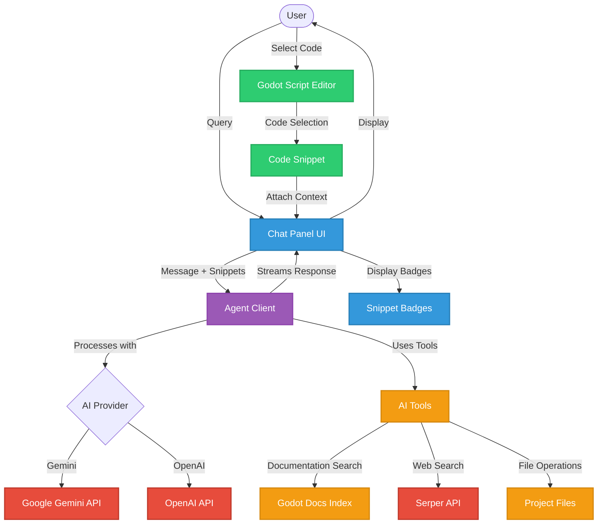

# G0: AI assistant for Godot.

https://github.com/user-attachments/assets/216f287c-7e8e-47f2-9f3b-ef2cbcb650cc

## Installation

### Prerequisites

- **Godot Engine 4.5+** with C# support enabled
- **.NET 8.0** or later
- **Git** (for cloning the repository)

### Installing the Plugin

1. **Clone the repository**
   ```bash
   git clone https://github.com/soumik12345/G0.git
   cd G0
   ```

2. **Open in Godot**
   - Launch Godot Engine
   - Click "Import" and select the `project.godot` file
   - Wait for Godot to import the project and build the C# assemblies

3. **Enable the plugin**
   - Go to `Project → Project Settings → Plugins`
   - Find "G0" in the plugin list
   - Enable the plugin by checking the box next to it

4. **Configure API keys**
   - The G0 chat panel will appear in the right dock
   - Click the settings button to configure your AI provider
   - Add your API key for one of the supported providers:
     - **Gemini API** (recommended): Get a key from [Google AI Studio](https://aistudio.google.com/)
     - **OpenAI API**: Get a key from [OpenAI Platform](https://platform.openai.com/)
     - **Azure OpenAI**: Configure your Azure endpoint and key

### Optional: Web Search Setup

To enable web search capabilities, obtain a [Serper API key](https://serper.dev/) and add it to the settings.

## Usage

1. **Access the chat interface**: Look for the "G0 Chat" panel in the right dock of the Godot Editor

2. **Start chatting**: Type your questions about Godot development, game design, or coding problems

3. **Watch the agent work**: G0 will autonomously search documentation, execute tools, and provide detailed responses

4. **File operations**: Use `@filename` syntax to reference specific files in your project for analysis

5. **Code snippets**: Select code in Godot's script editor and attach it as context to provide the AI with specific code sections to analyze or debug

### Example Queries

- "How do I create a 2D platformer character controller?"
- "Explain the difference between RigidBody2D and CharacterBody2D"
- "Help me debug this script: @player.gd"
- "Review this code snippet and suggest improvements" (with code snippet attached)
- "Why is this function not working as expected?" (with specific function code selected)
- "Show me best practices for scene management in Godot"

## Architecture

The G0 agent is built with a modular, layered architecture that integrates multiple AI providers, tools, and the Godot documentation system.



### Agent Architecture

The G0 agent implements an **agentic loop** with autonomous tool calling, supporting up to 5 iterations of reasoning and tool execution before generating a final response.

#### **Agent Core**
- **AgentClient**: Main orchestrator implementing the agentic loop
  - Manages conversation context and chat history
  - Controls streaming responses with real-time token delivery
  - Handles tool call detection and execution
  - Tracks reasoning steps for transparency
  - Supports cancellation and error recovery

#### **AI Provider Layer**
- **Multi-Provider Support**: Flexible architecture using `Microsoft.Extensions.AI.IChatClient` interface
  - **GeminiChatClientAdapter**: Google Gemini (primary, with streaming)
  - **OpenAI Client**: GPT-4o and other OpenAI models
  - **Azure OpenAI Client**: Enterprise Azure-hosted models
- Provider selection configured via `G0Settings.Provider`

#### **Agentic Loop Flow**
1. **Context Building**: Combines system prompt + chat history + user query
2. **LLM Request**: Sends context with registered tools to AI provider
3. **Response Analysis**: Detects tool calls in streaming response
4. **Tool Execution**: Invokes requested tools and collects results
5. **Iteration**: Adds tool results to context and continues (max 5 iterations)
6. **Final Response**: Returns answer when no more tool calls are needed

#### **Tools & Functions**
Built using `Microsoft.Extensions.AI` function calling framework:

**GodotDocsTool** - Local documentation search:
- `search_godot_docs(query, maxResults)`: Semantic search across documentation
- `get_godot_class_info(className)`: Detailed class information
- `list_godot_doc_topics()`: Available documentation categories

**SerperWebSearchTool** - Web search:
- `search_web(query, numResults)`: Google search via Serper API

**Documentation Index**:
- Pre-indexed Godot documentation (classes, tutorials, best practices)
- Keyword-based search with code examples
- Stored locally in `user://godot_docs_index.json`

#### **Step Tracking**
Every agent action is recorded as an `AgentStep`:
- **IterationStart**: Beginning of each reasoning cycle
- **Reasoning**: Agent's thought process (streamed in real-time)
- **ToolCall**: Tool invocation with arguments
- **ToolResult**: Tool execution results

This provides full transparency into the agent's decision-making process.

### Key Agent Capabilities

1. **Autonomous Decision Making**: Agent independently decides when and which tools to use based on user queries
2. **Multi-Iteration Reasoning**: Up to 5 reasoning cycles to solve complex problems requiring multiple tool calls
3. **Streaming Transparency**: Real-time visibility into agent's reasoning, tool calls, and results as they happen
4. **Context-Aware**: Maintains full conversation history and accumulates tool results for informed decision-making
5. **Godot-Specialized**: Pre-trained on Godot documentation with semantic search across classes, tutorials, and best practices
6. **Web-Connected**: Can search the internet for current information, external libraries, and community resources
7. **Code Snippet Integration**: Select code directly from Godot's script editor and attach it as context with automatic language detection and syntax highlighting
8. **Error Resilient**: Handles tool failures gracefully, continuing the agentic loop or providing informative errors

## Documentation

Full API documentation is available at: **[https://yourusername.github.io/g-0](https://yourusername.github.io/g-0)** *(Update this URL to match your GitHub username)*

The documentation is automatically generated from XML comments using DocFX and includes:
- Complete API reference for all classes and methods
- Architecture overview and design patterns
- Usage examples and best practices

### Building Documentation Locally

To build and preview the documentation locally:

```bash
# Install DocFX
dotnet tool install -g docfx

# Build the project to generate XML documentation
dotnet build G0.csproj --configuration Release

# Build documentation
docfx docfx.json

# Serve documentation locally
docfx serve _site
```

The documentation will be available at `http://localhost:8080`.
